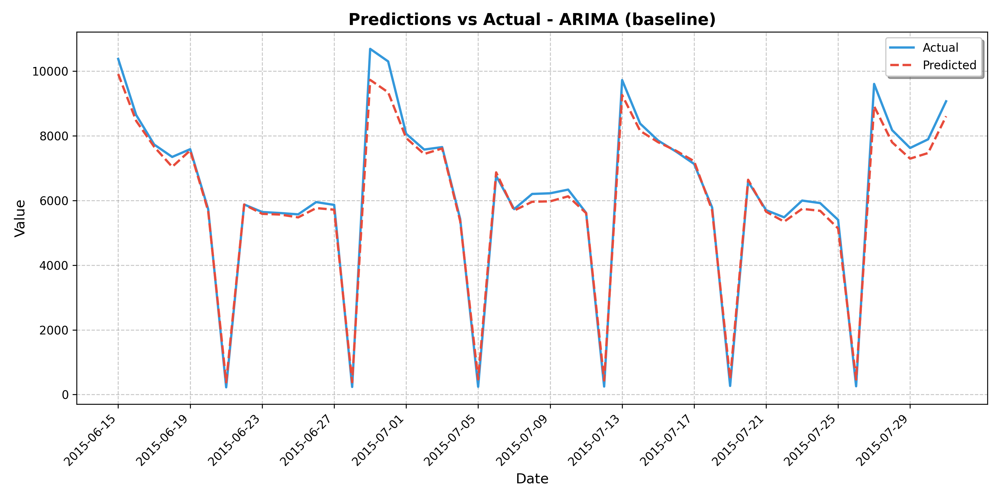
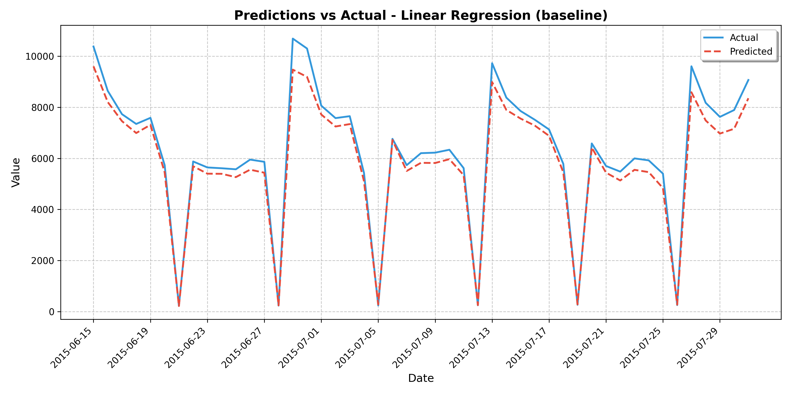
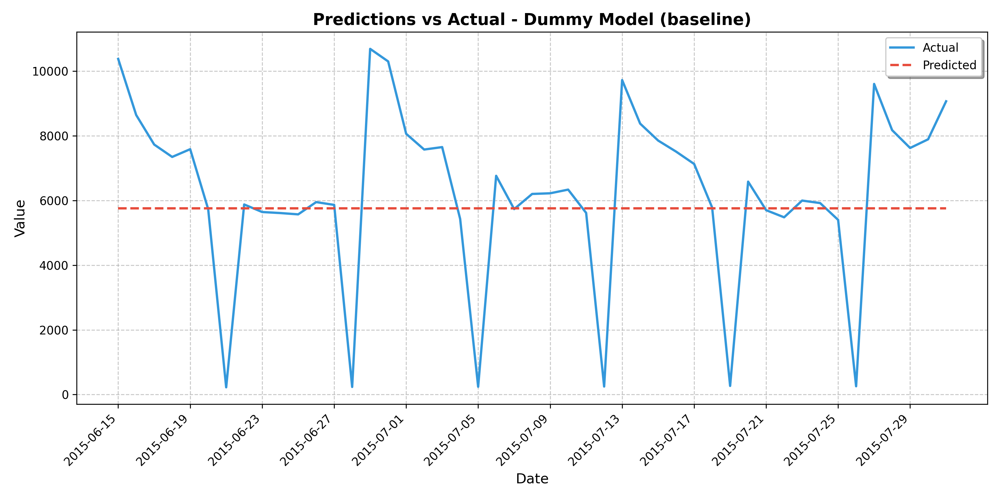
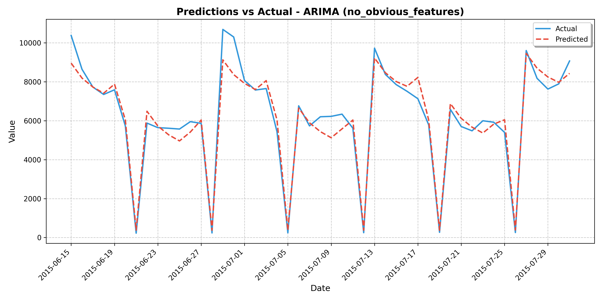
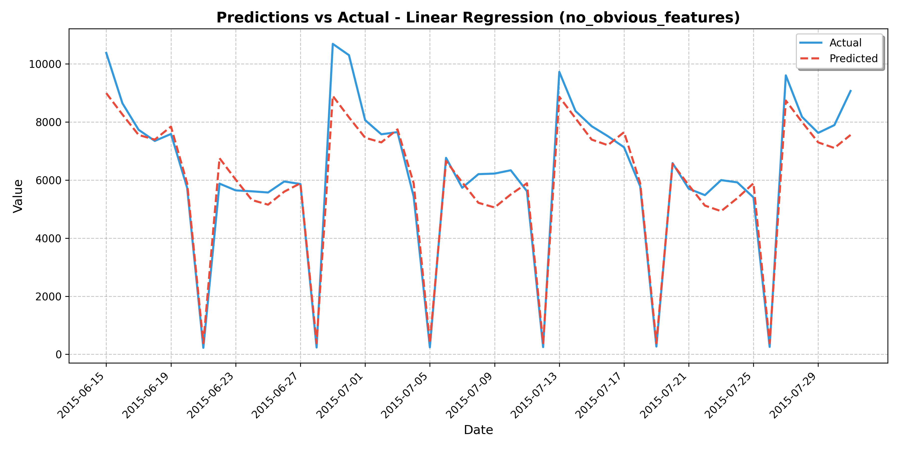
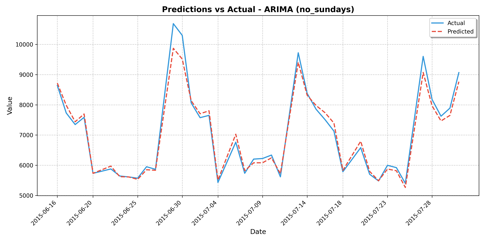
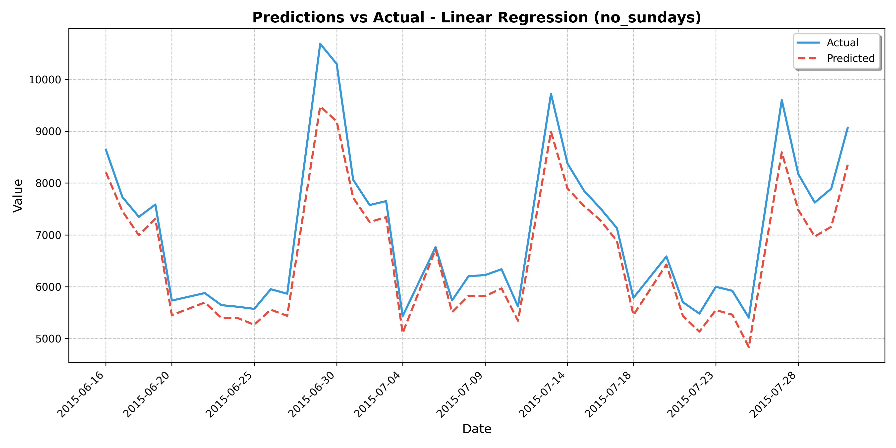
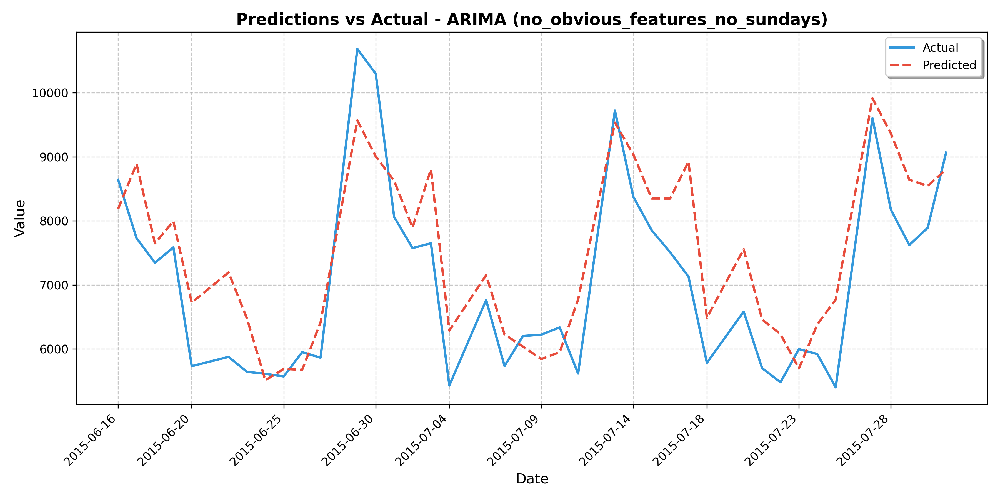
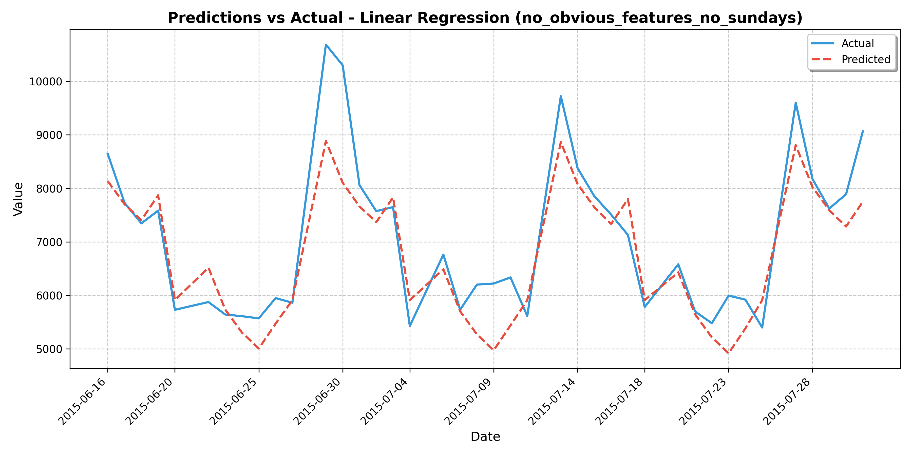

# Rossmann Time Series Analysis

## Project Overview

The goal of this project was to develop and train models that predict the average daily sales values for Rossmann stores based on various features. The project explores different experiment scenarios to find the optimal approach for sales prediction. We use three different models (ARIMA, Linear Regression, and a Dummy baseline model) and evaluate their performance across four experimental conditions.

## Features Used

The dataset contains several features that could influence sales predictions:

- **Customers**: Number of customers on a given day
- **Open**: Binary indicator showing whether the store was open (1) or closed (0)
- **Promo**: Binary indicator showing whether a promotion was running (1) or not (0)
- **SchoolHoliday**: Binary indicator showing whether the store was affected by school holidays
- **Day of Week**: One-hot encoded features representing each day of the week (DayIsMonday, DayIsTuesday, etc.)

Among these, 'Customers' and 'Open' are considered **obvious features** as they have a direct and strong correlation with sales. However, in real forecasting scenarios, these would not typically be used as predictors because:

1. They create circular prediction problems - we would need to forecast customers to forecast sales
2. They are trivial relationships - stores with zero customers or closed stores naturally have zero sales
3. They mask the influence of more interesting and actionable predictors like promotions or seasonal patterns

In our experiments, we deliberately include and exclude these obvious features to better understand the pure predictive power of the remaining variables and model architectures.

## Methodology

### Models Used

We evaluated three different modeling approaches:

1. **ARIMA (AutoRegressive Integrated Moving Average)**:
   ARIMA is a time series forecasting method that combines autoregressive (AR), differencing (I), and moving average (MA) components. It captures temporal dependencies in the data through:
   - **AR component**: Uses the dependent relationship between an observation and some number of lagged observations
   - **I component**: Makes the time series stationary by differencing (subtracting current from previous values)
   - **MA component**: Uses the dependency between an observation and a residual error from a moving average model applied to lagged observations
   
   ARIMA models are specified as ARIMA(p,d,q) where:
   - p is the number of lag observations (AR term)
   - d is the degree of differencing (I term)
   - q is the size of the moving average window (MA term)
   
   In our implementation, we use `auto_arima` from the `pmdarima` package to automatically select optimal parameters based on AIC (Akaike Information Criterion). The model was configured to account for weekly seasonality (m=7) since retail sales typically follow strong weekly patterns. This allowed the model to capture day-of-week effects in addition to the overall trend and short-term dependencies.

2. **Linear Regression**:
   A simple statistical model that assumes a linear relationship between the predictors (features) and the target variable (sales). Despite its simplicity, linear regression often provides robust predictions and serves as a good comparison baseline.

3. **Dummy Model**:
   A naive baseline that always predicts the mean sales value from the training data. This model provides a performance floor - any useful model should outperform the dummy.

### Packages Used

This project relies on several Python packages for data processing, modeling, and visualization:

- `pandas`: Used for data manipulation and analysis, providing the DataFrame structure that serves as the foundation for our data processing pipeline.

- `numpy`: Provides support for large, multi-dimensional arrays and matrices, along with mathematical functions to operate on these structures.

- `pmdarima`: Implements auto_arima, which automatically finds the optimal ARIMA parameters (p,d,q) for a given time series, simplifying the model selection process.

- `statsmodels`: Provides the core implementation of ARIMA models used for forecasting after parameter selection.

- `scikit-learn`: Supplies the implementations of Linear Regression and DummyRegressor, along with metrics for model evaluation.

- `matplotlib`: Powers all visualizations, including time series plots and performance comparisons.

- `logging`: Provides a flexible logging framework to track experiment progress and capture results.

- `PyYAML`: Used for loading configuration parameters from YAML files, allowing for easy experiment setup modification.

The project follows a modular architecture with separate components for data processing, model training, experiment execution, visualization, and reporting, all organized into a clean, maintainable codebase.

### Evaluation Metric

We use **Root Mean Square Error (RMSE)** to evaluate model performance. RMSE measures the square root of the average squared differences between predicted and actual values, with lower values indicating better performance.

## Experimental Conditions and Results

### 1. Baseline Experiment

In the baseline experiment, we used all available features including obvious indicators such as 'Customers' and 'Open' status. While this approach wouldn't be suitable for practical forecasting (since we wouldn't know future customer counts), it provides a useful reference point for evaluating model capabilities.

#### Results Analysis
The ARIMA model significantly outperformed both Linear Regression and the Dummy model in the baseline condition, achieving an RMSE of **303.15** compared to **471.72** for Linear Regression and **2741.95** for the Dummy model. 

This strong performance by ARIMA demonstrates its ability to effectively incorporate both feature information and temporal patterns in the sales data. The substantial gap between ARIMA and Linear Regression (55.60% improvement) suggests that the time-series component of the data contains valuable information that linear methods cannot capture.

The extremely poor performance of the Dummy model (RMSE = 2741.95) highlights the high variability in sales across different days and stores, emphasizing the need for sophisticated modeling approaches rather than simple averages.

#### Visualizations




### 2. No Obvious Features Experiment

In this experiment, we excluded obvious indicators ('Customers' and 'Open') to create a more realistic forecasting scenario that relies only on features that would be available in advance for future predictions.

#### Results Analysis
When relying solely on actionable predictors, model performance decreased substantially. The ARIMA model's RMSE increased to **598.18**, while Linear Regression increased to **687.49**.

This performance change demonstrates the challenge of real-world sales forecasting where future customer numbers are unknown. Without these obvious correlates, models must find more subtle patterns in the remaining features to make predictions.

Interestingly, ARIMA still maintained a performance advantage over Linear Regression, though the gap narrowed considerably (only 14.93% better, compared to 55.60% in the baseline). This suggests that ARIMA's time-series capabilities still extract additional value from temporal patterns, even when working with only genuine predictive features. The reduced advantage indicates that temporal dynamics become relatively more important when obvious correlations are removed from the equation.

#### Visualizations



### 3. No Sundays Experiment

This experiment excluded Sundays from the analysis to investigate the impact of weekly patterns and closed days on model performance.

#### Results Analysis
Excluding Sundays dramatically improved the performance of all models, with ARIMA achieving its best overall RMSE of **245.97**, representing a 19% improvement over the baseline. Linear Regression improved to an RMSE of **495.58**, while even the Dummy model showed substantial gains (RMSE = **1485.10** compared to 2741.95 in the baseline).

These remarkable improvements reveal the disruptive effect that Sundays have on prediction accuracy. Several factors likely contribute to this effect:

1. **Closure Pattern**: Most Rossmann stores are closed on Sundays, creating an irregular pattern in the time series that models struggle to accommodate.

2. **Zero-Inflation**: The high proportion of zero sales values on Sundays creates a bimodal distribution that is difficult for both linear and time-series models to handle.

3. **Temporal Discontinuity**: Sundays create a discontinuity in the otherwise smooth daily patterns, effectively breaking the week into disconnected segments.

The ARIMA model particularly benefited from this exclusion, showing 101.48% better performance than Linear Regression in this scenario. This dramatic advantage suggests that ARIMA's time series capabilities are especially effective when applied to regular, continuous data without the "noise" introduced by weekly closures.

The substantial improvement in the Dummy model further confirms that much of the variance in the original dataset was due to the Sunday pattern, as removing Sundays created a more homogeneous dataset where even simple averages become more predictive.

#### Visualizations



### 4. No Obvious Features & No Sundays Experiment

This experiment combined both previous modifications: excluding obvious features and removing Sundays from analysis, creating the most realistic forecasting scenario.

#### Results Analysis
This was the only experimental condition where Linear Regression (RMSE = **694.13**) outperformed ARIMA (RMSE = **799.56**), with a 13.19% advantage for Linear Regression. This surprising result reveals important insights about both models' strengths and limitations.

Several factors likely contribute to this reversal:

1. **Feature Relationship Shifts**: In a real forecasting scenario without trivial predictors, the remaining features like promotions and school holidays become the primary drivers of prediction. Linear Regression appears to utilize these categorical predictors more effectively.

2. **Reduced Temporal Signal**: Without the time-correlated 'Customers' feature, much of the temporal information that ARIMA relied on is no longer available. The pure time-series component alone appears insufficient for accurate predictions in this realistic scenario.

3. **Model Complexity Tradeoff**: The ARIMA model's complexity may become a disadvantage when working with fewer strong predictors. Linear Regression's simplicity becomes an advantage, focusing efficiently on the remaining signals without overfitting.

4. **Real-world Applicability**: This scenario most closely resembles a practical forecasting situation, where we need to predict future sales without knowing future customer counts, and where the irregular Sunday pattern has been handled separately.

This result highlights an important practical consideration: in realistic forecasting scenarios with limited advance knowledge of predictors, simpler models may outperform more complex time-series approaches.

#### Visualizations



## Summary of RMSE Results

| Experiment | ARIMA | Linear Regression | Dummy Model |
|-------------|-------|------------------|-------------|
| Baseline | 303.15 | 471.72 | 2741.95 |
| No Obvious Features | 598.18 | 687.49 | 2741.95 |
| No Sundays | 245.97 | 495.58 | 1485.10 |
| No Obvious Features & No Sundays | 799.56 | 694.13 | 1485.10 |

## Model Comparison Across Experiments

- **Baseline**: ARIMA is 55.60% better than Linear Regression
- **No Obvious Features**: ARIMA is 14.93% better than Linear Regression
- **No Sundays**: ARIMA is 101.48% better than Linear Regression
- **No Obvious Features & No Sundays**: ARIMA is -13.19% worse than Linear Regression (Linear Regression outperforms ARIMA!)

It's important to note that ARIMA outperforms Linear Regression in the "No Obvious Features" scenario (598.18 vs. 687.49), indicating that even in realistic forecasting scenarios without trivial predictors, ARIMA maintains an advantage as long as the data has regular patterns (including Sundays). Only when both obvious features are removed AND irregular patterns (Sundays) are excluded does Linear Regression gain an advantage.

## Key Insights

1. **ARIMA Effectiveness**: ARIMA models generally outperform Linear Regression for sales forecasting when temporal patterns are consistent, even though this advantage diminishes in more realistic prediction scenarios without obvious predictors.

2. **Sunday Effect**: Excluding Sundays from analysis dramatically improves ARIMA model. This demonstrates how irregular patterns and zero-inflation from closed days can disrupt forecasting accuracy. The best overall result was achieved using ARIMA with no Sundays (RMSE = 245.97).

3. **Realistic Forecasting Challenges**: When moving to more realistic scenarios where we can only use features knowable in advance (excluding customers and open status), the prediction task becomes substantially more difficult. This mirrors real-world forecasting challenges where future customer counts are unknown.

4. **ARIMA's Data Requirements**: Importantly, when comparing scenarios without obvious features, ARIMA still outperformed Linear Regression as long as Sundays were included (598.18 vs. 687.49). This highlights that ARIMA isn't inherently worse for realistic forecasting, but rather requires appropriate data preparation (like handling irregular business days) to perform optimally.


## How to Run the Project

1. **Clone the Project**: Clone the repository to your local machine.
   ```bash
   git clone https://github.com/yourusername/Rossmann-Time-Series-Analysis.git
   ```

2. **Install Dependencies**: Ensure you have all necessary packages installed.
   ```bash
   pip install -r requirements.txt
   ```

3. **Add Data**: Place the `train.csv` file in the `data` folder at the project root directory. You can download the dataset from [Kaggle](https://www.kaggle.com/competitions/rossmann-store-sales).

4. **Run the Main Script**: Execute the main script to run all experiments and generate results.
   ```bash
   python main.py
   ```

## Project Structure

```bash
Rossmann-Time-Series-Analysis/
├── data/
│   └── train.csv
├── main.py
├── config/
│   └── config.yaml
├── results/
│   ├── [generated plots]
│   └── training.log
├── src/
│   ├── data/
│   │   ├── __init__.py
│   │   ├── loading.py
│   │   ├── transformations.py
│   │   ├── filtering.py
│   │   ├── validation.py
│   │   └── preprocessing.py
│   ├── experiments/
│   │   ├── __init__.py
│   │   ├── execution.py
│   │   ├── preparation.py
│   │   ├── models_management.py
│   │   └── definitions.py
│   ├── logging/
│   │   ├── __init__.py
│   │   ├── setup.py
│   │   ├── experiment_logs.py
│   │   └── reporting.py
│   ├── models/
│   │   ├── __init__.py
│   │   ├── base_model.py
│   │   ├── arima_model.py
│   │   ├── linear_regression_model.py
│   │   ├── dummy_model.py
│   │   └── factory.py
│   ├── utils/
│   │   ├── __init__.py
│   │   ├── config.py
│   │   └── constants.py
│   └── visualization/
│       ├── __init__.py
│       ├── plots.py
│       └── experiment_plots.py
└── requirements.txt
```


## Future Directions

While our current implementation shows promising results, several avenues for improvement exist:

### Multiple Seasonality Modeling

Our ARIMA models were configured only for weekly seasonality (m=7), but retail sales typically exhibit both weekly and yearly seasonal patterns. We did not implement yearly seasonality due to computational constraints, as models with long seasonal periods (m=365) require significantly more memory and processing power than was available.

Alternative approaches to capture multiple seasonality patterns include:

- **TBATS or Prophet models**: Specifically designed to handle multiple seasonality with lower computational requirements
- **SARIMA with Fourier terms**: Using Fourier series as external regressors to represent longer seasonal patterns
- **Data aggregation**: Working with weekly data instead of daily data to reduce the seasonal period length

### Advanced Modeling Approaches

Other potential improvements include:

- **Store clustering**: Grouping similar stores before modeling to capture location-specific patterns
- **Hierarchical forecasting**: Building separate models for different temporal patterns and store characteristics
- **Neural network approaches**: Exploring LSTM or other deep learning models that can implicitly capture complex temporal dependencies

Implementing these extensions would likely yield further improvements in forecasting accuracy, particularly for longer-term predictions where annual seasonal patterns become more significant.
